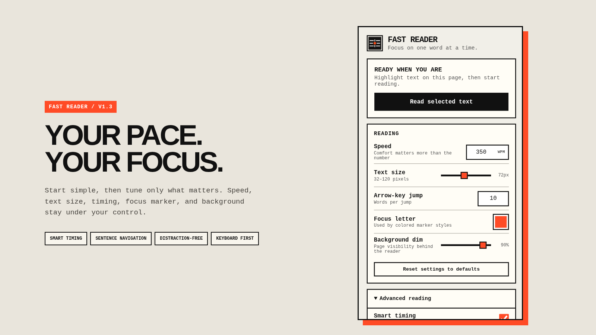
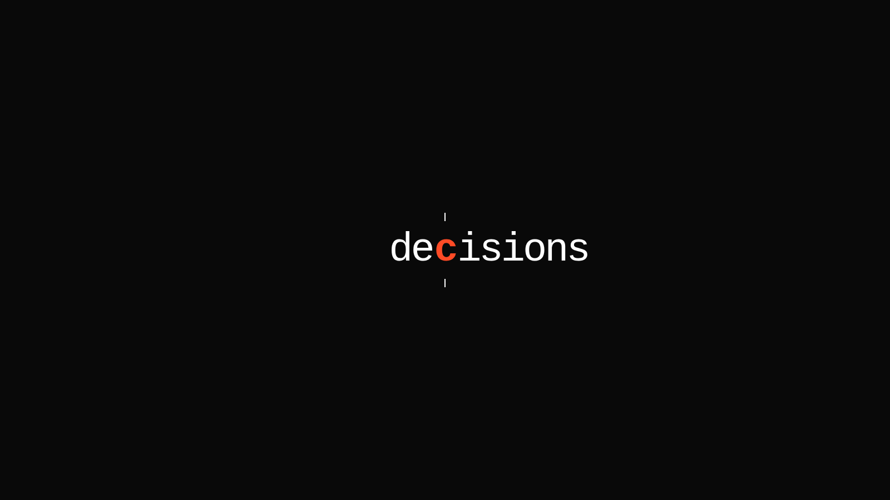
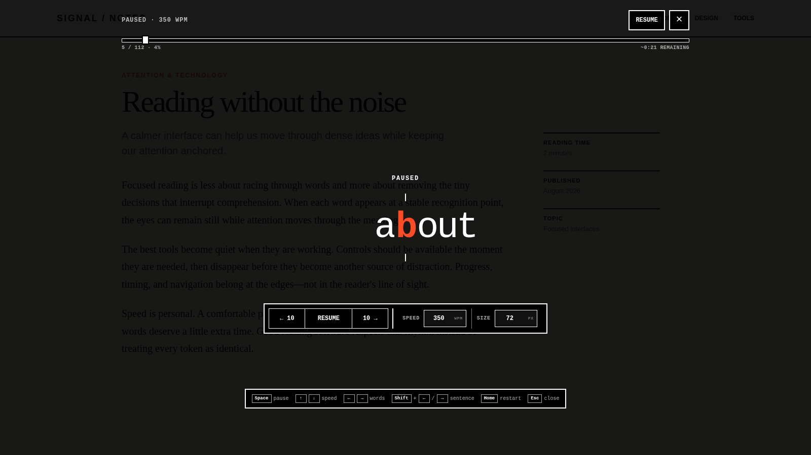

# RSVP Shift

RSVP Shift is a focused Chrome speed reader. Highlight text on almost any webpage and read it one word at a time using RSVP (rapid serial visual presentation).

## Screenshots


*A focused reading experience with fast, practical controls and a bold red visual identity.*


*Distraction-free RSVP reading with a fixed red focus letter.*


*Keyboard-first controls stay available when needed and out of the way while reading.Pause, scrub through the selection, adjust speed, or jump between words without losing your place*


## Install in Chrome

1. Open `chrome://extensions`.
2. Turn on **Developer mode** in the top-right.
3. Click **Load unpacked**.
4. Select this project folder.
5. Pin **RSVP Shift** from Chrome's Extensions menu if you want quick access.

After updating the code, click the extension's **Reload** button on `chrome://extensions`, then reload any page that was already open.

## Use it

1. Highlight text on a webpage. Text selected inside normal text fields also works.
2. Press `Ctrl+Shift+Q` (`Command+Shift+Q` on macOS), or open the extension and click **Read selected text**.
3. Follow the highlighted focus letter while the words advance.

The reader keeps the focus letter fixed, hides its controls during playback, adds natural punctuation and long-word timing, and pauses automatically if you leave the tab. Move the pointer or press `?` whenever you need the controls.

| Control | Action |
| --- | --- |
| `Space` | Pause or resume |
| `↑` / `↓` | Increase or decrease speed |
| `←` / `→` | Jump backward or forward |
| `Shift` + `←` / `→` | Move to the previous or next sentence |
| `Home` | Restart the selection |
| `?` | Show or hide controls and help |
| `Esc` | Close the reader |

You can drag the progress bar to reread any part of the selection. Scrubbing pauses playback and resumes automatically if the reader was playing beforehand.

## Settings

The popup lets you adjust:

- Reading speed from 50 to 1200 WPM
- Text size from 32 to 120 pixels
- Arrow-key jump size
- Focus-letter color
- Background dimming

Advanced settings stay collapsed until needed and include:

- Smart long-word timing and punctuation pause strength
- Optional previous/next context (off by default)
- Colored, underlined, block, or disabled focus markers
- Fixation guide strength
- Dimmed-page or solid-black background
- Start delay and automatic control hiding

Settings are validated, saved with `chrome.storage.sync`, and shared across tabs. You can change the global shortcut at `chrome://extensions/shortcuts`.

## Privacy

RSVP Shift runs entirely in your browser. Selected text is processed only on the current page and is never sent anywhere. Only your reader settings are stored through Chrome sync.

## Troubleshooting

- **Nothing happens:** Reload the webpage once after installing or reloading the extension.
- **The shortcut does not work:** Check `chrome://extensions/shortcuts`; Chrome may have found a conflict.
- **A page is unsupported:** Chrome blocks extensions on internal pages such as `chrome://` pages and the Chrome Web Store.
- **Local files do not work:** Open the extension's details on `chrome://extensions` and enable **Allow access to file URLs**.

## Development

This is a dependency-free Manifest V3 extension—there is no build step. The main files are:

- `content.js` and `style.css`: reading overlay and behavior
- `popup.html`, `popup.css`, and `popup.js`: extension popup
- `settings.js`: shared defaults and validation
- `background.js`: keyboard shortcut handling
- `manifest.json`: Chrome extension configuration

Quick syntax check:

```bash
node --check settings.js
node --check content.js
node --check popup.js
node --check background.js
```
